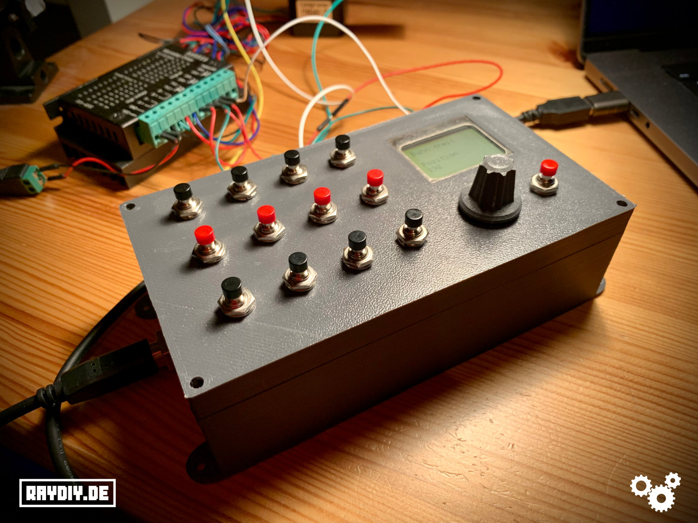
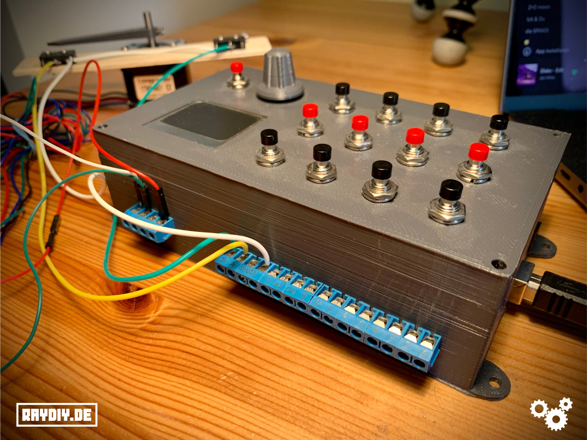

# LokLiftController

Eine Arduino Steuerungs-Box für einen Lok Lift – ein Lift-System für Modell-Eisenbahnen.

Die Box ist auf einem Arduino Mega aufgebaut und hat folgende Features:

- 12 Positionen speicherbar
- einfaches Speichern der Gleis-Positionen
- per Drehschalter ist der Motor direkt steuerbar
- zwei verschiedene Motor-Modi: schnelle Motor-Bewegung und Feinjustierung
- einfache externe Anbindung der 12 Positionsschalter (z.B. für eine Computer-Steuerung)

**ACHTUNG:** wenn die EndStops ausgelöst werden, muss der Motor abrupt stoppen bevor die Richtung gewechselt wird. Möglicherweise können durch das abrupte Stoppen Züge aus den Gleisen geworfen werden. Ich empfehle die Streckenmessung und das Einstellen der Positionen lieber zunächst ohne Züge einzustellen. Oder probiert es zunächst nur mit einem Zug testweise aus.

Wenn du auf Nummer sicher gehen willst, lese erst die komplette Anleitung und stelle alle benötigten Positionen ein (Speichern nicht vergessen!). Erst danach solltest du die Gleise mit Zügen bestücken. Beim normalen Anfahren der abgespeicherten Positionen, sollten die Endstopps nie ausgelöst werden.

**ACHTUNG:** Wenn die Controller-Box aus- und wieder angeschaltet wird, wird einmal der Endstopp A angefahren (**Kalibrations-Fahrt**), damit die Controller-Box weiß, wo der Lift gerade steht. Wenn das ein Problem sein sollte (abrupter Stopp am Endstopp), dann entweder die Box immer laufen lassen, damit sie keinen Kalibrations-Fahrt macht. Oder die Geschwindigkeit der Kalibrations-Fahrt verringern (im Einstellungs-Menu unter Punkt **CalRPM**).

## Motor-Treiber anschließen

Hier Beschreibe ich, wie ich den Motor-Treiber angeschlossen habe. Wie man den Schrittmotor an den Motor-Treiber anschließt, hängt vom jeweiligen Motor-Treiber und der Art der Schritt-Motoren ab, daher gehe ich darauf nicht genauer ein. Das sollte Teil der Dokumentation zu deinem Motor-Treiber und Schrittmotoren sein. Google ist auch immer hilfreich 😉

Im folgenden Schema sieht man, wie ich mein Setup angeschlossen habe:

TODO Bild

Das Ganze ist so ausgelegt, dass du für den Motor-Treiber und für die Controller-Box jeweils ein eigenes Netzteil benötigts.
Mein Motor-Treiber benötigt zwischen 9 und 42 Volt und müssen über die beiden Terminals VCC und GND angeschlossen werden.
Ich habe ein 12 Volt Netzteil verwendet und mit einer fertigen Hohlbuchse mit Terminal das Ganze verbunden. 

TODO Bild

Die Controller-Box bzw. der darin verbaute Arduino Mega kann mit einem 7 bis 12 Volt Netzteil über die Hohlbuchse betrieben werden. Hier könntest du also das gleiche Netzteil verwenden. Oder mit 5 Volt über die USB-Buchse wäre auch möglich.

Hier die Links zu Netzteil und Controller-Box:
[Netzteil 12 V](https://geni.us/XL8mi2)
[Hohlbuchse 5,5 mm mit Terminal Adapter](https://geni.us/BXMjbb)

## Motor an Motor-Treiber anschließen

In meinem Test-Setup habe ich einen 17HS4401 Bi-Polar Schritt-Motor verwendet. Bi-Polare Schritt-Motoren haben vier Kabel und haben normalerweise immer die gleichen Farben. Ich habe sie folgendermaßen an den Treiber angeschlossen:

| Motor    | Motor-Treiber | 
| -------- | ------------- | 
| Schwarz  | A+            |
| Grün     | A-            | 
| Rot      | B+            |
| Blau     | B-            | 

[TODO: Bild]

**ACHTUNG:** Natürlich musst du für einen Lok-Lift einen größeren Motor und Treiber verwenden. Wir testen demnächst diese beiden Typen. Ich werden berichten, wie sich damit der Controller schlägt:
[Nema34 12NM Schrittmotor und Treiber](https://geni.us/hxMw)

## Endstopps anschließen

Die Endstopps müssen auch mit der Controller-Box verbunden werden. Achte darauf NO (normally open) Endstopps zu verwenden. Meine verwendeten Endstopps können sowohl NO als auch NC (normally closed). Deswegen haben diese Endstopps drei Pins: einen für NO, einen für NC und einen für Ground. 

Du musst also den NO Pin von EndstoppA an dem Terminal A der Controller-Box anschließen. Entsprechend den NO Pin von Ensdtopp B an Terminal B. Und beide Ground Pins der Endstopps werden ebenfalls an Ground der Controller-Box angeschlossen.

[TODO: Bild/Schema]

Hier die Links zu meinen verwendeten Endstopps:
[Endstopp Mikroschalter mit Rollenhebel](https://geni.us/ZmCi)

## Erster Start

Wenn alles korrekt verkabelt ist, können wir den LokLift-Controller starten. Die Stromversorgung des Motor-Treibers würde ich zuerst herstellen. Dann die COntroller-Box mit Strom versorgen. Kuz darauf wird der Start-Bildschirm angezeigt.

Im Start-Bildschirm hat man 5 Sekunden Zeit, um die Streckenmessung zu starten. Der Ablauf der 5 Sekunden wird duch die Punkte visualisiert.

Drückt man während dieser 5 Sekunden auf den roten Speichern-Taster (rechts neben dem grauen Dreh-Knopf) startet man die Streckenmessung.
Drückt man während dieser 5 Sekunden auf den grauen Dreh-Knopf gelangt man ins Einstellungs-Menu.

Falls du einen Schrittmotor verwendet, der keine 200 PPR bzw 1,8° pro Schritt verwendet, solltest du zunächst den MotPPR Wert anpassen. Wie das geht, findet du im Abschnitt **Einstellungs-Menu**

Wir wollen zunächst die Streckenmessung starten.

## Streckenmessung

Dieser Vorgang ist wichtig und sollte als erstes einmalig durchgeführt werden. Sollte sich am Aufbau deines Lifts etwas ändern, muss die Streckenmessung erneut durchgeführt werden. Ausserdem sollten die gespeicherten Position erneut eingestellt und abgespeichert werden.

Bei der Streckenmessung fährt der Motor die beiden Endstopps an und speichert die Länge (Scrhitte des Motors) der dabei gefahrene Strecke ab. Dies ist notwendig, um später die Positionen genau anfahren zu können.

Wenn die Streckenmessung startet fährt der Motor zunächst zum Endstopp B (Motor-Drehrichtung im Uhrzeigersinn, wenn man von oben auf den Schaft schaut).
Sobald Endstopp B erreicht ist wechselt die Drehrichtung des Motors (entgegen Uhrzeigersinn) und fährt zurück bis Endstopp A ausgelöst wird.
Bitte achte bei deinem Aufbau darauf, dass die Endstopps entsprechend angeordnet sind und der Motor sich wie beschrieben dreht, so dass genau die Abfolge wie beschrieben durchgeführt werden kann.

Falls der Motor sich falsch dreht, schaue auch mal im Bereich **Tipps/Fehlerbehebungen** nach.

TODO: SKIZZE AUFBAU

Nachdem am Ende der Streckenmessung Endstopp A erreicht wurde, setzt der Motor wieder kurz zurück, damit der Endstopp A nicht dauerhaft 
ausgelöst wird. Die gemessene Wegstrecke wird automatisch gespeichert. Die Streckenmessung ist nun abgeschlossen und die Box geht in den normalen Betrieb über.

Das Display gibt eine entsprechende Meldung aus.

## Normaler Betrieb (ohne Streckenmessung)

Wenn innerhalb der 5 Sekunden im Start-Bildschirm nichts gedrückt wird bzw. nach der Streckenmessung fährt der Motor zunächst Endstopp A einmal an, damit der Controller weiß, wo sich der Lift befindet. Im Display erscheint dann **Kalibrierung ...**

TODO BILD

Sobald "Bahn frei!" im Display erscheint, kann die Box normal verwendet werden, d.h. also Positionen über die 12 Positions-Schalter anfahren 
oder neue Positionen abspeichern.

## Positionen auf den 12 Tastern speichern

Wenn die Kalibierung abgeschlossen ist, kannst du nun beginnen, neue Position auf die 12 Taster zu speichern. Dau musst du zunächst die gewünschte Position anfahren. Um das zu erreichen, gibt es zwei verschiedene Motor-Modi – eine fürs grobe anfahren und einen für die Fin-Jusztierung. Nach der Kalibierung ist zunächst der Motor-Modus **Lauf-Modus** aktiv. 

#### Lauf-Modus

Der **Lauf-Modus** ist für eine schnelle (grobe) Einstellung gedacht. Mit dem Drehregler steuert man die 
Geschwindigkeit des Motors. Der Motor läuft immer weiter, bis er gestoppt wird. Sollte der Motor einen Endstopp auslösen, wird die Richtung 
des Motors geändert.

Um den Motor anzuhalten kann man entweder den Drehregler nutzen, um die Geschwindigkeit bis auf Null zu verlangsamen, oder einfach auf den 
Drehregler drücken. 

Das Drücken stoppt den Motor sofort. Ausserdem wechselt der Modus nun in den **Schritt-Modus**. In der Regel ist dies auch 
erwünscht, da man nach der groben Anfahrt nun in die Feinjustierung wechseln möchte. 

Falls dies nicht gewünscht ist, einfach ein weiteres Mal auf den Drehregler drücken, dann ist der **Lauf-Modus** wieder aktiv. 

Im Display wird der aktuelle Modus auch kurz durch eine entsprechende Nachricht dargestellt.

TODO BILD
TODO BILD

Wenn man den Motor-Modus wechselt, wird die Geschwindigkeit immer zurückgesetzt, damit der Motor nicht automatisch losläuft. D.h. die 
Geschwindigkeit ist nach dem Modus-Wechsel immer Null. 

#### Schritt-Modus
Im "Schritt-Modus" wird mit jedem Schritt des Drehreglers ein einzelner Motor-Schritt gefahren. So können die Gleise sehr genau ausgerichtet werden.

Ein Druck auf den Dreh-Regler wechselt wieder in den **Lauf-Modus**.

## Positionen abspeichern speichern

Hat der Lift nun die gewünschte Position erreicht, muss die Position auf einem der 12 Positions-Taster abgespeichert werden.

Dazu drücke einmal auf den roten Speichern-Taster (rechts neben dem Dreh-Regler). So weiss die Box, dass die Position nun gespeichert werden soll.
Anschließend drücke einen der 12 Positions-Taster, um die Position auf diesen Schalter zu speichern.

TODO BILD

Falls das Speichern abgebrochen werden soll, einfach nochmal den Speichern-Taster drücken.

TODO BILD

Wenn du alle Position gespeichert hast, kannst du nun Züge auf die Gleise setzen. Mit den Positions-Tastern werden die gespeicherten Positionen sanft  angefahren. Vorsichtiges nachjustieren und erneutes abspeichern sollte mit Zügen kein Problem sein. Passe nur auf, dass du keinen der Endstopps erreichst, da hier die Richtung möglicherweise zu abrupt geändert wird. Allerdings dürfte das nur beim Arbeiten mit dem **Lauf-Modus** passieren. Und bei der Kalibrierungsfahrt nach einem Neustart des Controllers oder bei der Streckenemessung.

## Positionen anfahren

Wenn auf den 12 Tastern Positionen gespeichert sind, einfach den entsprechenden Taster drücken, um die Position anzufahren. Während des 
Anfahrens sind keine weiteren Aktionen möglich.

Wurde auf dem Taster noch keine Position gespeichert, erscheint nur eine entsprechende Meldung im Display.

## Einstellungs-Menu

Im Einstellungs-Menu können Motor-Parameter angepasst werden. Du hast zwei Möglichkeiten, um es zu öffnen:
- während der 5 sekündigen Startphase den Dreh-Regler drücken
- im normalen Betrieb den Dreh-Regler doppelt drücken

Folgende Parameter können dort eingestellt werden

#### MaxRPM – Maximum RPM
Die maximale Motorgeschwindigkeit in RPM, die der Motor beim Anfahren der Positionen oder im **Lauf-Modus** erreichen kann.
#### MinRPM – Minimal RPM
Die minimale Motorgeschwindigkeit in RPM. Das ist die Startgeschwinbdigkeit im **Lauf-Modus**
#### CalRPM – Calibration RPM
Die Motorgeschwindigkeit in RPM, die während der Kalibrierungsfahrt eingestellt wird.
#### AccStp – Acceleration Steps
Die Anzahl der Schritte während der ein sanftes Anfahren bzw. Abbremsen durchgeführt werden soll. 
Beispiel: dieser Wert steht auf 200 und die neue Position, die angefahren werdne soll, ist 1000 Schritte entfernt. Dann würde während der ersten 200 Schritte ein sanftes Anfahren durchgefürt werden. Ab Schritt 201 wird die maxRPM erreicht. Ab Schritt 800 wird dann wieder sanft bis zum Ziel abgebremst.  
#### MotPPR – Motor Pulses per Round
Hier musst du den PPR Wert deines Motors angeben. Der PPR Wert gibt, wieviele Schritte ein Motor für einen volle Umdrehung benötigt.
Oft findet man Motoren mit 200 PPR – das entspricht 1,8° pro Schritt. Wenn du nur die Angabe in Grad pro Schritt hast, dann teile 360° durch die Gard pro Schritt Angabe. Zum Beispiel: 360° / 1,8° = 200 PPR.

## Links

## Tipps/Fehlerbehebungen

#### Der Motor dreht sich falsch herum.

Sollte der Motor sich bei der Streckenmessung falsch herum drehen, kann man dies ändern in dem man die Kabel des Motors der Gruppe A oder B anders am Motor-Treiber anschließt.

Also entweder das schwarze und das grüne Kabel tauschen.

| Motor    | Motor-Treiber | 
| -------- | ------------- | 
| Grün     | A+            |
| Schwarz  | A-            | 
| Rot      | B+            |
| Blau     | B-            | 

 Oder das rote und das blaue Kabel tauschen:

| Motor    | Motor-Treiber | 
| -------- | ------------- | 
| Schwarz  | A+            |
| Grün     | A-            | 
| Blau     | B+            |
| Rot      | B-            | 

Vorrausgesetzt der Motor und der Treiber sind korrekt verdrahtet und beschriftet.

Du kannst auch prüfen ob Scharz/Grün bzw. Rot/Blau wirklich in eine Gruppe sind. Wenn du mit dem Multimeter (im Durchgangsmodus mit Piep oder Ohmmessung) auf prüfst, müssen die Kabel, die in einer Gruppe sind eine Verbindung haben (also piepen).
